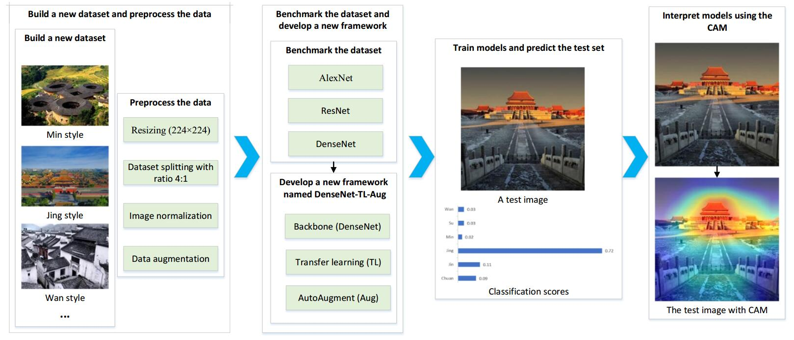

<div align="center">

<h3 align="center">Classification of Chinese Traditional Architectural Styles</h3>

<p align="center">
  
</p>

<p align="center">
    A framework for training, evaluating, and interpreting deep learning models for classifying Chinese traditional architectural styles.
<br />
    <a href="https://www.mdpi.com/2072-4292/14/20/5250"><strong>Explore our paper »</strong></a>
<br />
<br />
    <a href="https://github.com/PointCloudYC/CTS/issues">Report Bug</a>
    ·
    <a href="https://github.com/PointCloudYC/CTS/issues">Request Feature</a>
</p>

<p align="center">
    <a href="https://github.com/PointCloudYC/CTS/blob/main/LICENSE">
        
    </a>
</p>
</div>

---

This project implements and evaluates deep learning models for classifying Chinese traditional architectural styles, based on the paper [Towards Classification of Architectural Styles of Traditional Settlements using DL: A Dataset, a New Framework, and Its Interpretability](https://www.mdpi.com/2072-4292/14/20/5250).

## Key Features

- **Model Training**: Train baseline and transfer-learning models with conventional and learning-based data augmentation (e.g., AutoAugment).
- **Comprehensive Evaluation**: Calculate key metrics including accuracy, precision, recall, and F1-score.
- **Performance Visualization**: Generate confusion matrices to visualize model performance on the test set.
- **Model Interpretability**: Create Class Activation Maps (CAMs) to understand which parts of an image a model focuses on.
- **Results Synthesis**: Aggregate results from multiple experiments into a consolidated report.

## Getting Started

### Prerequisites

- Python 3.8+
- We recommend using a virtual environment (`uv`, `conda`, or `venv`).

### Installation

1.  **Clone the Repository**
    ```sh
    git clone https://github.com/PointCloudYC/CTS.git
    cd CTS
    ```

2.  **Set Up Virtual Environment**
    Choose your preferred tool:
    ```sh
    # uv
    uv venv -p 3.10
    source .venv/bin/activate

    # conda
    conda create -n CTS python=3.10 -y
    conda activate CTS

    # venv
    python3 -m venv .venv
    source .venv/bin/activate
    ```

3.  **Install Dependencies**
    The required packages are listed in `requirements.txt`.
    ```sh
    # use uv
    uv pip install torch==2.1.1 torchvision==0.16.1 torchaudio==2.1.1 --index-url https://download.pytorch.org/whl/cu121
    uv pip install -r requirements.txt

    # or use pip with conda
    conda install pytorch==2.1.1 torchvision==0.16.1 torchaudio==2.1.1 pytorch-cuda=12.1 -c pytorch -c nvidia -y
    pip install -r requirements.txt
    ```

### Dataset

1.  Download the dataset from [ArchiStyle dataset](https://hkustconnect-my.sharepoint.com/:u:/g/personal/cyinac_connect_ust_hk/EW357p4zW0JKoadv5Ywcp7oBFBZ63RKSpjeRBXFokeIm-A?e=AQiD5u).
2.  Unzip the contents into the `data/` directory. The paper uses `ArchiStyle-v1`.

The expected directory structure is:

```
CTS/
├── data/
│   ├── ArchiStyle-v1/
│   │   ├── train/
│   │   ├── val/
│   │   └── test/
├── ...
```

Note: the `scripts/convert_dataset.py` is used to convert the raw dataset to the training format.

## Usage

This project uses shell scripts to streamline experiments. Results are saved in the `experiments-v1/` directory.

-   **Run pre-configured experiments:**
    ```sh
    # Run baseline and transfer-learning models on ArchiStyle-v1 (for the paper)
    bash scripts/run-v1.sh
    ```

### Advanced Usage

-   **Generate a Confusion Matrix**
    ```sh
    python function/evaluate.py \
        --model_dir experiments-v1/alexnet_pretrained \
        --data_dir data/ArchiStyle-v1 \
        --model_name alexnet \
        --pretrained \
        --save_confusion_matrix
    ```
more details can be found in `scripts/generate_confusion_matrix.sh`

-   **Generate Class Activation Maps (CAMs)**
    ```sh
    python function/generate_cam.py \
        --model_dir experiments-v1/alexnet_pretrained \
        --data_dir data/ArchiStyle-v1 \
        --model_name alexnet \
        --pretrained \
        --num_images_per_class 5
    ```
more details can be found in `scripts/generate_cam.sh`

-   **Synthesize Results**
    ```sh
    # For ArchiStyle-v1 experiments
    python function/synthesize_results.py --parent_dir experiments-v1
    ```

## Project Structure

```
├── data/                 # Datasets
├── experiments-v1/       # Results for models on ArchiStyle-v1
├── experiments-xx/       # Results for models on xx datasets
├── function/             # Core scripts (train, evaluate, etc.)
├── grad-cam/             # Original Grad-CAM implementation
├── model/                # Model definitions and data loaders
├── scripts/              # Shell scripts to run experiments
└── ...
```

## Citation

If you use this project in your research, please cite the paper:

```bibtex
@article{CTS,
    Author = {Qing HAN, Chao YIN*, Yunyuan DENG, Peilin LIU},
    Title = {Towards Classification of Architectural Styles of Chinese Traditional Settlements using Deep Learning: A Dataset, a New Framework, and Its Interpretability},
    Journal = {Remote Sensing},
    Year = {2022}
}
```